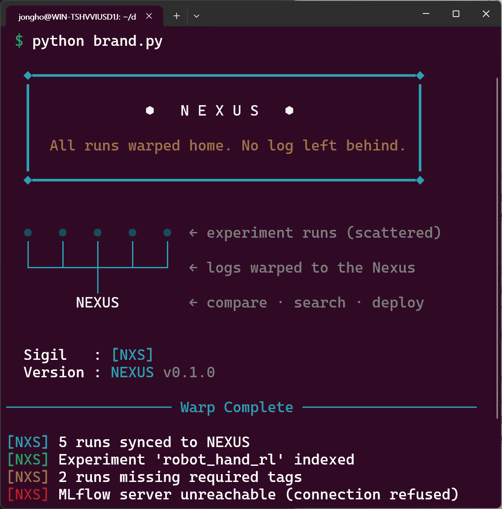

<div align="center">

# 🔷 NEXUS · Centralized RL Experiment Hub



**Stop chasing tfevents. Start comparing runs.**

*Unified logging · MLflow + TensorBoard · Air-gapped sync · Team-wide visibility*

---

[](https://python.org)
[](https://mlflow.org)
[](https://www.tensorflow.org/tensorboard)
[](LICENSE)

📖 Team onboarding guide (Korean): [`docs/INTRO_KO.md`](docs/INTRO_KO.md)

</div>

---

## 📌 Why NEXUS?

Dexterous manipulation demands running hundreds of experiments — reward shaping sweeps, tactile feedback ablations, Sim-to-Real transfer evaluations. Each run produces logs that scatter across individual machines, making team-wide comparison painful.

**NEXUS is the central point where all experiment data converges.**

| Without NEXUS | With NEXUS |
|---|---|
| Logs scattered across personal directories | All runs visible in one MLflow UI |
| "Can you send me your tfevents?" | Filter by experiment, compare curves instantly |
| Hyperparameters lost in commit history | Stored as MLflow params, searchable forever |
| Long training crashes → data gone | Incremental sync preserves intermediate results |
| Team decisions undocumented | Confluence pages linked to every run |

---

## 📁 Repository Structure

```
nexus/
│
├── logger/                         # Unified logging package
│   ├── __init__.py                 # make_logger() factory (core exports only)
│   ├── dual_logger.py              # TensorBoard + MLflow simultaneously
│   ├── mlflow_logger.py            # MLflow-only logger
│   ├── tb_logger.py                # TensorBoard wrapper (legacy compat)
│   ├── sweep_logger.py             # [Advanced] HP sweep parent run
│   ├── model_registry.py           # [Advanced] Model Registry operations
│   ├── rl_metrics.py               # [Advanced] RL diagnostic metric helpers
│   └── system_metrics.py           # [Advanced] Background CPU/GPU logging
│
├── post_upload/                    # Upload after training
│   ├── tb_to_mlflow.py             # Full tfevents → MLflow batch upload
│   └── verify_upload.py            # Numeric validation vs. TB source
│
├── scheduled_sync/                 # Sync while training runs (air-gapped SCP)
│   ├── start_local_mlflow.sh       # [GPU Server] start local MLflow server
│   ├── sync_mlflow_to_server.sh    # [GPU Server] delta export → SCP → import
│   ├── export_delta.py             # [GPU Server] serialize new metrics only
│   └── import_delta.py             # [MLflow server] import delta JSON
│
├── tests/
│   └── smoke_test.py               # End-to-end local validation script
│
├── docs/
│   ├── ARCHITECTURE.md             # Full system design & component map
│   ├── LOGGER_SETUP.md             # Logger integration guide (step-by-step diff)
│   ├── VALIDATION_GUIDE.md         # Step-by-step validation guide
│   ├── MLFLOW_SERVER_SETUP.md      # MLflow server setup guide
│   ├── EXPERIMENT_STANDARD_KO.md   # Team experiment management standard (Korean)
│   ├── INTRO_KO.md                 # Onboarding document (Korean)
│   └── ADVANCED_FEATURES.md        # Advanced features guide (opt-in)
│
├── brand.py                        # ASCII art, sigils, color constants
├── setup.sh
└── github_init.sh
```

---

## 🏗️ Infrastructure

```
[GPU Server]                               [NEXUS Server]
  No internet — SCP/SSH only                 Internet accessible
  Isaac Lab / PPO training                   MLflow Tracking UI :5000

  ┌────────────────────────────┐             ┌─────────────────────────┐
  │  ╷  ╷  ╷  ╷  ╷             │             │                         │
  │  ●  ●  ●  ●  ●  (GPUs)     │             │  [NXS] MLflow central   │
  │  │  │  │  │  │             │   SCP/SSH   │                         │
  │  ●──●──●──●──●  (bus)      │ ──────────> │  All runs, all teams    │
  │         │                  │             │  Compare · Analyze      │
  │      local MLflow :5100    │             │                         │
  │      (loopback only)       │             │  http://<server>:5000   │
  └────────────────────────────┘             └─────────────────────────┘
```

---

## 🎛️ Logger Modes

Use `make_logger()` with the `mode` argument. Only this argument changes — everything else in PPO stays exactly the same.

| `mode` | TensorBoard | MLflow | When to use |
|:---:|:---:|:---:|---|
| `"dual"` | ✅ | ✅ | **Recommended** — transition period |
| `"mlflow"` | ❌ | ✅ | After team fully adopts NEXUS |
| `"tensorboard"` | ✅ | ❌ | Rollback / no NEXUS server available |

---

## ⚡ Quick Start

```bash
git clone https://github.com/jonghochoi/nexus.git
cd nexus
bash setup.sh --alias          # installs venv at ~/.nexus/venv + registers `nexus-activate`
source ~/.bashrc               # pick up the alias
nexus-activate                 # works from any directory, any terminal
```

> The venv lives at `~/.nexus/venv` — **outside** the repo — so overwriting or
> re-cloning the source tree does not destroy the installed packages. Run
> `bash setup.sh --reinstall` if you ever need to rebuild it from scratch.
>
> Prefer no alias? Drop `--alias` and activate with
> `source ~/.nexus/activate.sh`.

---

## 🅰️ Pipeline A — Direct MLflow Logging *(recommended for new runs)*

Requires changes in **3 locations** in PPO. TensorBoard continues to work unchanged.

### Step 1 — Start local MLflow server on GPU Server *(once per session)*

```bash
bash scheduled_sync/start_local_mlflow.sh
# [NXS] Local MLflow on 127.0.0.1:5100 — loopback only, no internet needed
```

### Step 2 — Update PPO *(3 locations only)*

Replace `SummaryWriter` with `make_logger` at the import, `__init__`, and `train()` checkpoint block.

→ Copy-paste diff: [`docs/LOGGER_SETUP.md`](docs/LOGGER_SETUP.md)

### Step 3 — Sync to NEXUS server *(via cron, every 5 min)*

Each sync is **incremental**: only metric points with step beyond the last synced step are transferred. Per-run state is cached in `/tmp/nexus_delta_{experiment}.json`.

```bash
*/5 * * * * bash /path/to/nexus/scheduled_sync/sync_mlflow_to_server.sh \
    --experiment       robot_hand_rl \
    --remote           user@nexus-server:/data/mlflow_delta_inbox \
    --remote_nexus_dir /opt/nexus \
    >> /path/to/sync_cron.log 2>&1
```

---

## 🅱️ Pipeline B — TensorBoard Post-Upload *(one-shot, no code changes)*

Use when PPO has **not** been updated yet, or when you want to upload a completed tfevents run in a single batch. This is a manual, one-time operation — run it once after training ends.

### One-time setup — put your fixed values in `~/.nexus/config.json`

```bash
mkdir -p ~/.nexus
cp post_upload/config.example.json ~/.nexus/config.json
$EDITOR ~/.nexus/config.json   # set tracking_uri, researcher, team-fixed tags
```

Example:

```json
{
  "tracking_uri": "http://nexus-server:5000",
  "experiment": "robot_hand_rl",
  "tags": {
    "researcher": "kim",
    "isaac_lab_version": "1.2.0",
    "physx_solver": "TGS",
    "hardware": "robot_22dof"
  }
}
```

### Uploading a run

With the config above, you only need to supply the per-run values (`seed`, `task`) — and if any of the required tags (`researcher`, `seed`, `task`) are missing, the CLI drops into interactive mode automatically:

```bash
cd post_upload/

# Interactive — prompts for seed and task, auto-verifies after upload
python tb_to_mlflow.py --tb_dir /path/to/logs/run_001

# Or fully non-interactive
python tb_to_mlflow.py \
    --tb_dir   /path/to/logs/run_001 \
    --run_name ppo_baseline_v1 \
    --tags     seed=42 task=in_hand_reorientation
```

After upload completes, `verify_upload.py` runs automatically against the returned run_id. Pass `--no_verify` to skip, or run `python verify_upload.py --run_id <id> --tb_dir <dir>` manually.

| Flag | Effect |
|---|---|
| `-i`, `--interactive` | Prompt for every required tag (researcher, seed, task), showing config values as defaults |
| `--tags k=v ...` | Per-run tag overrides (wins over config) |
| `--repeat-last` | Inherit experiment/run_name/tags from the last upload (for seed sweeps) |
| `--history` | List recent uploads (`~/.nexus/history.json`) and exit |
| `--config <path>` | Use a config file other than `~/.nexus/config.json` |
| `--force` | Skip required-tag validation |
| `--no_verify` | Skip automatic post-upload verification |
| `--dry_run` | Parse and preview only; don't upload |

For full details on config, interactive mode, history, `sim_run_id` auto-detection for real-robot evals, and troubleshooting, see [`docs/POST_UPLOAD_GUIDE.md`](docs/POST_UPLOAD_GUIDE.md).

> 💡 For long-running training that needs **scheduled** sync (not just post-hoc), use Pipeline A with `make_logger(mode="dual")` or `mode="mlflow"`.

---

## 🖥️ What's Running Where

```
🖥️  GPU Server  ───────────────────────────────────────────────
│
├── 🤖  PPO Training Process
│   └── 🔀  DualLogger
│       ├── 📁  → tfevents/         local disk  (tensorboard --logdir)
│       └── 📡  → 127.0.0.1:5100    local MLflow server
│
├── 🗄️  Local MLflow Server         (start_local_mlflow.sh — always on)
│   └── 💾  all run data stored in mlruns/
│
└── 🔄  sync_mlflow_to_server.sh    (cron, every 5 min)
    └── ⬆️  :5100 ──SCP──► central :5000

🌐  Central Server  ───────────────────────────────────────────
└── 📊  MLflow Server :5000
    └── 🧑‍🤝‍🧑  full team experiment history · UI · run comparison
```

| When | Where to look |
|---|---|
| ⚡ During training | Local server `localhost:5100` — instant, no internet needed |
| 👥 Team review / run comparison | Central server `:5000` |
| 🔌 Network outage | No data loss — local server buffers everything until sync resumes |

---

## 🏷️ Recommended Tags *(reproducibility)*

> ⚠️ Isaac Lab / PhysX results are non-deterministic without fixed seeds and solver configs.
> Set these tags for **every** run — no exceptions.

| Tag | Example | Required |
|---|---|:---:|
| `researcher` | `kim` | ✅ |
| `seed` | `42` | ✅ |
| `isaac_lab_version` | `1.2.0` | ✅ |
| `physx_solver` | `TGS` | ✅ |
| `task` | `in_hand_reorientation` | ✅ |
| `hardware` | `robot_22dof` | ✅ |
| `sim_run_id` | `<upstream_run_id>` | ✅ *(real-robot eval only)* |

> 💡 `sim_run_id` links a real-robot evaluation run back to the exact sim policy deployed — critical for Sim-to-Real failure tracing.

---

## 📚 Further Reading

| Document | Description |
|---|---|
| [`docs/INTRO_KO.md`](docs/INTRO_KO.md) | Team onboarding — motivation, workflow, FAQ (Korean) |
| [`docs/ARCHITECTURE.md`](docs/ARCHITECTURE.md) | Full system design and component map |
| [`docs/LOGGER_SETUP.md`](docs/LOGGER_SETUP.md) | Logger integration — step-by-step diff (trainer-agnostic) |
| [`docs/POST_UPLOAD_GUIDE.md`](docs/POST_UPLOAD_GUIDE.md) | Pipeline B CLI in depth — config, interactive, history, sim_run_id |
| [`docs/VALIDATION_GUIDE.md`](docs/VALIDATION_GUIDE.md) | Step-by-step validation guide |
| [`docs/MLFLOW_SERVER_SETUP.md`](docs/MLFLOW_SERVER_SETUP.md) | MLflow server setup on LAN |
| [`docs/EXPERIMENT_STANDARD_KO.md`](docs/EXPERIMENT_STANDARD_KO.md) | Team experiment management standard |
| [`docs/ADVANCED_FEATURES.md`](docs/ADVANCED_FEATURES.md) | Advanced features — SweepLogger, RL metrics, Model Registry, system metrics |
| [`brand.py`](brand.py) | ASCII art, sigils, and color constants |

---

## 📦 Dependencies

| Package | Version |
|---|---|
| `mlflow` | `2.13.0` |
| `tbparse` | `0.0.8` |
| `tensorboard` | `2.16.2` |
| `tensorboardX` | latest |
| `pandas` | latest |
| `rich` | latest |

```bash
bash setup.sh             # installs all dependencies into ~/.nexus/venv
bash setup.sh --alias     # same, plus register `nexus-activate` in ~/.bashrc
bash setup.sh --reinstall # wipe and recreate ~/.nexus/venv (after source overwrite)
```
